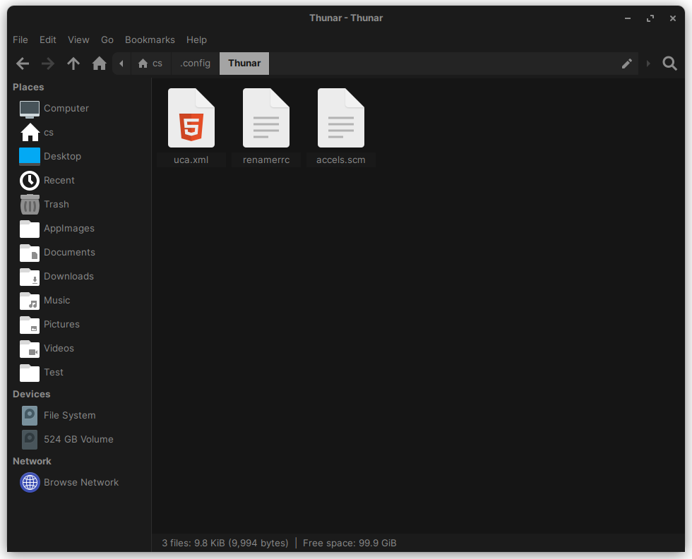

# Settings

The following document contains all the tangible application settings, or some form of explicit instructions to replicate the desired [configuration](configuration.md) of the liveCD.

## Desktop Environment

### Tweaks

The gsetting configuration for `gnome-shell-extensions-prefs` is as follows:

```bash
gsettings set org.gnome.shell.extensions.user-theme name 'ZorinGrey-Dark'
gsettings set org.gnome.desktop.interface cursor-theme 'Adwaita'
gsettings set org.gnome.desktop.interface icon-theme 'ZorinGrey-Dark'
gsettings set org.gnome.desktop.sound theme-name 'freedesktop'
gsettings set org.gnome.desktop.interface gtk-theme 'ZorinGrey-Dark'
gsettings set org.gnome.desktop.background picture-options 'zoom'
gsettings set org.gnome.desktop.background picture-uri ''
gsettings set org.gnome.desktop.interface font-name 'Inter 10'
gsettings set org.gnome.desktop.interface document-font-name 'Sans 10'
gsettings set org.gnome.desktop.interface monospace-font-name 'JetBrains Mono 10'
gsettings set org.gnome.desktop.wm.preferences titlebar-font 'Inter Bold 10'
gsettings set org.gnome.desktop.interface font-antialiasing 'rgba'
gsettings set org.gnome.desktop.interface font-hinting 'medium'
gsettings set org.gnome.desktop.interface text-scaling-factor 1.0
gsettings set org.gnome.desktop.input-sources show-all-sources false
gsettings set org.gnome.desktop.interface gtk-key-theme 'Default'
gsettings set org.gnome.mutter overlay-key 'Super_L'
gsettings set org.gnome.desktop.interface locate-pointer false
gsettings set org.gnome.desktop.interface gtk-enable-primary-paste true
gsettings set org.gnome.desktop.peripherals.touchpad disable-while-typing true
gsettings set org.gnome.desktop.peripherals.touchpad click-method 'fingers'
gsettings set org.gnome.desktop.peripherals.mouse accel-profile 'default'
gsettings set org.gnome.desktop.interface clock-show-weekday true
gsettings set org.gnome.desktop.interface clock-show-date true
gsettings set org.gnome.desktop.interface clock-show-seconds true
gsettings set org.gnome.desktop.calendar show-weekdate false
gsettings set org.gnome.desktop.wm.preferences action-double-click-titlebar 'toggle-maximize'
gsettings set org.gnome.desktop.wm.preferences action-middle-click-titlebar 'none'
gsettings set org.gnome.desktop.wm.preferences action-right-click-titlebar 'menu'
gsettings set org.gnome.desktop.wm.preferences button-layout 'appmenu:minimize,maximize,close'
gsettings set org.gnome.mutter attach-modal-dialogs true
gsettings set org.gnome.mutter center-new-windows false
gsettings set org.gnome.desktop.wm.preferences resize-with-right-button false
gsettings set org.gnome.desktop.wm.preferences mouse-button-modifier '<Super>'
gsettings set org.gnome.desktop.wm.preferences focus-mode 'click'
gsettings set org.gnome.desktop.wm.preferences auto-raise false
gsettings set org.gnome.desktop.sound allow-volume-above-100-percent false
```

For reference, here is each command with it's corresponding GUI Location:
| Command                                                                                          | Location                                                 |
|--------------------------------------------------------------------------------------------------|----------------------------------------------------------|
| `gsettings set org.gnome.shell.extensions.user-theme name 'ZorinGrey-Dark'`                      | Appearance -> Themes -> Shell                            |
| `gsettings set org.gnome.desktop.interface cursor-theme 'Adwaita'`                               | Appearance -> Themes -> Cursor                           |
| `gsettings set org.gnome.desktop.interface icon-theme 'ZorinGrey-Dark'`                          | Appearance -> Themes -> Icons                            |
| `gsettings set org.gnome.desktop.sound theme-name 'freedesktop'`                                 | Appearance -> Themes -> Alert Sound                      |
| `gsettings set org.gnome.desktop.interface gtk-theme 'ZorinGrey-Dark'`                           | Appearance -> Themes -> Legacy Applications              |
| `gsettings set org.gnome.desktop.background picture-options 'zoom'`                              | Appearance -> Background -> Adjustment                   |
| `gsettings set org.gnome.desktop.background picture-uri ''`                                      | Appearance -> Background -> Image                        |
| `gsettings set org.gnome.desktop.interface font-name 'Inter 10'`                                 | Fonts -> Interface Text                                  |
| `gsettings set org.gnome.desktop.interface document-font-name 'Sans 10'`                         | Fonts -> Document Text                                   |
| `gsettings set org.gnome.desktop.interface monospace-font-name 'JetBrains Mono 10'`              | Fonts -> Monospace Text                                  |
| `gsettings set org.gnome.desktop.wm.preferences titlebar-font 'Inter Bold 10'`                   | Fonts -> Legacy Window Titles                            |
| `gsettings set org.gnome.desktop.interface font-antialiasing 'rgba'`                             | Fonts -> Antialiasing                                    |
| `gsettings set org.gnome.desktop.interface font-hinting 'medium'`                                | Fonts -> Hinting                                         |
| `gsettings set org.gnome.desktop.interface text-scaling-factor 1.0`                              | Fonts -> Scaling Factor                                  |
| `gsettings set org.gnome.desktop.input-sources show-all-sources false`                           | Keyboard & Mouse -> Keyboard -> Show All Input Sources   |
| `gsettings set org.gnome.desktop.interface gtk-key-theme 'Default'`                              | Keyboard & Mouse -> Keyboard -> Emacs Input              |
| `gsettings set org.gnome.mutter overlay-key 'Super_L'`                                           | Keyboard & Mouse -> Keyboard -> Overview Shortcuts       |
| `gsettings set org.gnome.desktop.interface locate-pointer false`                                 | Keyboard & Mouse -> Mouse -> Pointer Location            |
| `gsettings set org.gnome.desktop.interface gtk-enable-primary-paste true`                        | Keyboard & Mouse -> Mouse -> Middle Click Paste          |
| `gsettings set org.gnome.desktop.peripherals.touchpad disable-while-typing true`                 | Keyboard & Mouse -> Touchpad -> Disable While Typing     |
| `gsettings set org.gnome.desktop.peripherals.touchpad click-method 'fingers'`                    | Keyboard & Mouse -> Mouse Click Emulation                |
| `gsettings set org.gnome.desktop.peripherals.mouse accel-profile 'default'`                      | Keyboard & Mouse -> Mouse -> Acceleration Profile        |
| `gsettings set org.gnome.desktop.interface clock-show-weekday true`                              | Top Bar -> Clock -> Weekday                              |
| `gsettings set org.gnome.desktop.interface clock-show-date true`                                 | Top Bar -> Clock -> Date                                 |
| `gsettings set org.gnome.desktop.interface clock-show-seconds true`                              | Top Bar -> Clock -> Seconds                              |
| `gsettings set org.gnome.desktop.calendar show-weekdate false`                                   | Top Bar -> Calendar -> Week Numbers                      |
| `gsettings set org.gnome.desktop.wm.preferences action-double-click-titlebar 'toggle-maximize'`  | Windows Titlebars -> Titlebar Actions -> Double-click    |
| `gsettings set org.gnome.desktop.wm.preferences action-middle-click-titlebar 'none'`             | Windows Titlebars -> Titlebar Actions -> Middle-click    |
| `gsettings set org.gnome.desktop.wm.preferences action-right-click-titlebar 'menu'`              | Windows Titlebars -> Titlebar Actions -> Secondary-Click |
| `gsettings set org.gnome.desktop.wm.preferences button-layout 'appmenu:minimize,maximize,close'` | Windows Titlebars -> Titlebar Buttons                    |
| `gsettings set org.gnome.mutter attach-modal-dialogs true`                                       | Windows -> Attach Modal Dialogs                          |
| `gsettings set org.gnome.mutter center-new-windows false`                                        | Windows -> Center New Windows                            |
| `gsettings set org.gnome.desktop.wm.preferences resize-with-right-button false`                  | Windows -> Resize with Secondary-Click                   |
| `gsettings set org.gnome.desktop.wm.preferences mouse-button-modifier '<Super>'`                 | Windows -> Windows Action Key                            |
| `gsettings set org.gnome.desktop.wm.preferences focus-mode 'click'`                              | Windows -> Windows Focus                                 |
| `gsettings set org.gnome.desktop.wm.preferences auto-raise false`                                | Windows -> Windows Focus -> Raise Windows When Focused   |
| `gsettings set org.gnome.desktop.sound allow-volume-above-100-percent false`                     | General -> Over-Amplification                            |

## File Manager

### Thunar


*What the Thunar File Manager should look like*

Create the following 'Open Terminal Here' and 'Open as Root' actions under `$XDG_CONFIG_HOME/.config/Thunar/uca.xml`'s `<actions></actions>` block:

```xml
<actions>
	<action>
		<icon>utilities-terminal</icon>
		<name>Open Terminal Here</name>
		<submenu/>
		<unique-id>1689224791084051-1</unique-id>
		<command>exo-open --working-directory %f --launch TerminalEmulator</command>
		<description>Example for a custom action</description>
		<range/>
		<patterns>*</patterns>
		<startup-notify/>
		<directories/>
	</action>
	<action>
		<icon>dialog-password</icon>
		<name>Open as Root</name>
		<submenu/>
		<unique-id>1689401683694822-1</unique-id>
		<command>pkexec thunar %f</command>
		<description/>
		<range>*</range>
		<patterns>*</patterns>
		<directories/>
	</action>
	<action>
		<icon/>
		<name/>
		<submenu/>
		<unique-id>1689402208795292-2</unique-id>
		<command/>
		<description/>
		<range>*</range>
		<patterns>*</patterns>
	</action>
...
</actions>
```

where the packages `exo-utils` and `pkexec` are required to implement the actions.

## Terminal

Enabling scrollbar in the [Sakura](https://github.com/dabisu/sakura) terminal emulator will require the line`scrollbar=true` in `sakura.conf`. 

## Text Editor

The configuration should match the following dconf preferences:

```bash
[org/xfce/mousepad/preferences/file]
add-last-end-of-line=false
auto-reload=false
autosave-timer=uint32 30
default-encoding='UTF-8'
make-backup=false
monitor-changes=true
monitor-disabling-timer=uint32 500
session-restore='after-a-crash'

[org/xfce/mousepad/preferences/view]
auto-indent=false
color-scheme='oblivion'
font-name='Monospace 10'
highlight-current-line=true
indent-on-tab=true
indent-width=-1
insert-spaces=false
match-braces=false
right-margin-position=uint32 80
show-line-endings=true
show-line-marks=false
show-line-numbers=true
show-right-margin=false
show-whitespace=false
smart-backspace=false
smart-home-end='disabled'
tab-width=uint32 8
use-default-monospace-font=true
word-wrap=true

[org/xfce/mousepad/preferences/view/show-whitespace]
inside=true
leading=true
trailing=true

[org/xfce/mousepad/preferences/window]
always-show-tabs=false
client-side-decorations=false
cycle-tabs=false
default-tab-sizes='2,3,4,8'
expand-tabs=true
menubar-visible=true
menubar-visible-in-fullscreen='auto'
old-style-menu=true
opening-mode='tab'
path-in-title=true
recent-menu-items=uint32 10
remember-position=false
remember-size=true
remember-state=true
statusbar-visible=false
statusbar-visible-in-fullscreen='auto'
toolbar-icon-size='small-toolbar'
toolbar-style='icons'
toolbar-visible=false
toolbar-visible-in-fullscreen='auto'
```
